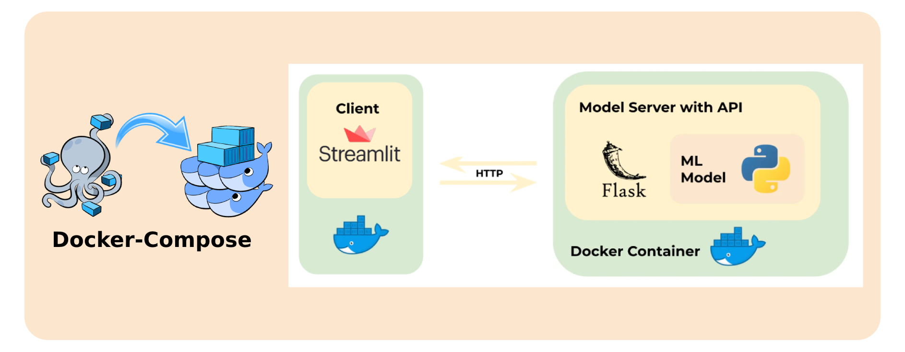
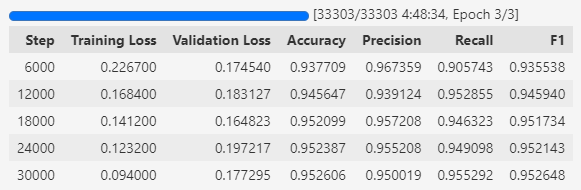
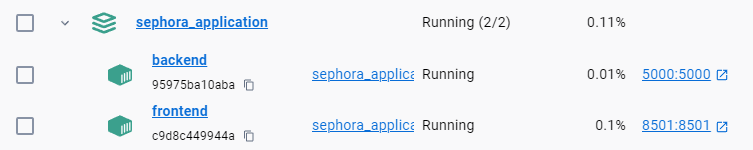
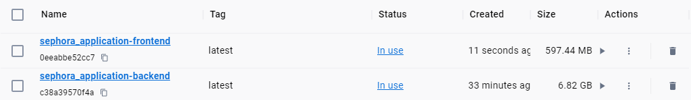
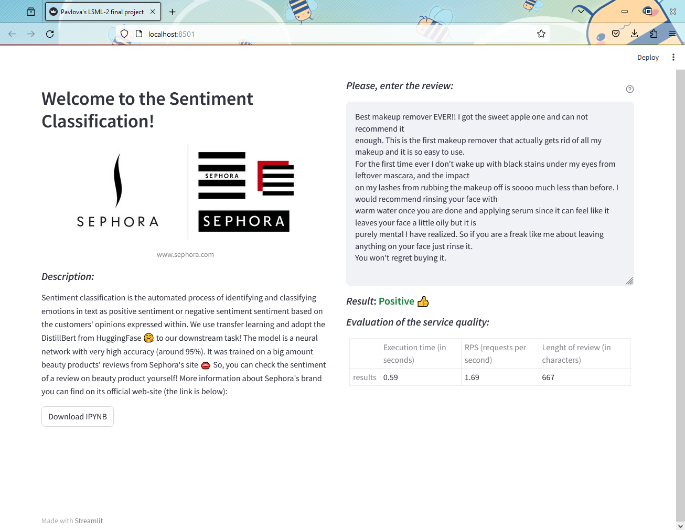
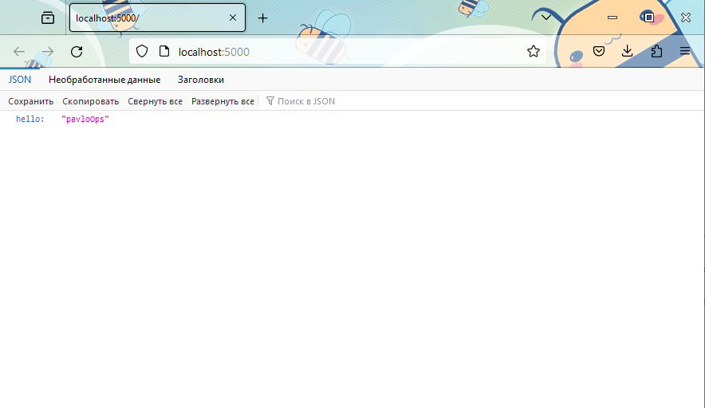

    

# LSML2 Final Project 
## «Sentiment Analysis for Beauty products of SEPHORA»

### 1. Project documentation

📁 lsml2/ 
├─📁 backend/ 
│ ├─📄 backend_api.py 
│ ├─📄 Dockerfile 
│ └─📄 requirements.txt 
├─📄 docker-compose.yaml 
├─📁 dataset/ 
│ ├─📄 EDA.ipynb 
│ ├─📄 samples_for_testing.txt 
├─📁 frontend/ 
│ ├─📄 Dockerfile 
│ ├─📄 frontend.py 
│ ├─📁 materials/ 
│ │ ├─📄 NLP_SEPHORA_TRAINING.zip 
│ │ └─📄 sephora_label.png 
│ └─📄 requirements.txt 
├─📁 pics/ 
└─📄 README.md 

#### 1.1. Design document, architecture

Let's create two Docker containers which have everything needed to run applications and interact with each other in one network via Docker-Compose. From the one hand, there ia a front-end application that is managed using Streamlit and offers a beautiful user interface. And from another hand, there is the backend application, which uses a prepared neural network for predictions and works via an API.

#### 1.2. Run instructions (env, commands)

**Step 1**: Create new folder in your local host and make git clone:

    git clone https://github.com/PavloOps/lsml2.git

**Step 2**: Set the PavloOps-lsml2_Pavlova folder in your folder from Step 1 as current working directory (here is example for Windows OS, please, use the cwd installation command appropriate for your OS):

    cd .\lsml2\

**Step 3**: Next command aggregates the output of each container:

    docker-compose up

**Step 4**: Open next link in your browser to check a health of backend (API):

    http://localhost:5000/

**Step 5**: Open next link in your browser to interact with User Interface (UI):

    http://localhost:8501/ 

**Step 6**: After starting the User Interface, there will be default text suggested. And let's try some case, for example, next one (from [samples of text](https://github.com/PavloOps/lsml2/blob/main/dataset/samples_for_testing.txt)):

    I’m disappointed. It does make my face look fresh, but doesn’t remove
    blackheads. I bought it because it states in the name that it clears pores. Not
    what I expected for this price. It is a nice texture though.

#### 1.3. Losses, metrics
There was used transfer learning and adoptation of the [DistillBert](https://huggingface.co/transformers/v3.0.2/model_doc/distilbert.html) from HuggingFase 🤗 to our downstream task. 
The model has high accuracy (around 95%). Learning was performed with Kaggle's GPU Tesla P100-PCIE-16GB.

### 2. Data set
* The model was trained on a big amount beauty products' reviews from [Kaggle dataset](https://www.kaggle.com/datasets/nadyinky/sephora-products-and-skincare-reviews). Data was collected via DataScrapping from the [Sephora's official website](www.sephora.com) Initially, there were around 1M of marked reviews as positive or negative according to the option "I recommend it";
* [Dataset](https://drive.google.com/drive/folders/1aOvmIq8wkfFavt2n6pCvQ4PN7Tl8OKXd?usp=sharing): To handle with an imbalanced target (16% of negative reviews and 84% of positive reviews), there was used an under-sampling technique. Finally, in total there are around 300K of reviews for training the model and 50/50 of negative and positive reviews. Check train/val/test split via next [IPYNB with EDA](https://github.com/PavloOps/lsml2/blob/main/dataset/EDA.ipynb)

### 3. Model training code
#### 3.1. Jupyter Notebook
* [IPYNB with training](https://github.com/PavloOps/lsml2/blob/main/frontend/materials/NLP_SEPHORA_TRAINING.zip) can be also upload via UI after docker-compose up;

#### 3.2. MLFlow project
* 🤦‍♀️🤗👄

### 4. Service deployment and usage instructions
#### 4.1. Docker-compose file

Working containers:

Images' sizes:

#### 4.2. Client for service

* User Interface was implemented in frontend via [Streamlit](https://streamlit.io/). From UI via HTTP-requests the user's text is posted as JSON-file to the backend;
* Possible RPS (requests per second) depends on a length of a text (example in the table on the screenshot below). For example, for the review of 667 characters length there is 1.69 RPS:

#### 4.3. Backend architecture

Backend architecture was implemented via Flask framework. It recieve user's text from UI, make prediction (negative or positive) via our DistillBert which was adopted to our downstream task and returns it back to UI. 

#### 4.4. Model
The abstract from the [paper](https://medium.com/huggingface/distilbert-8cf3380435b5) is the following:

> As Transfer Learning from large-scale pre-trained models becomes more prevalent in Natural Language Processing (NLP), operating these large models in on-the-edge and/or under constrained computational training or inference budgets remains challenging. In this work, we propose a method to pre-train a smaller general-purpose language representation model, called DistilBERT, which can then be fine-tuned with good performances on a wide range of tasks like its larger counterparts. While most prior work investigated the use of distillation for building task-specific models, we leverage knowledge distillation during the pre-training phase and show that it is possible to reduce the size of a BERT model by 40%, while retaining 97% of its language understanding capabilities and being 60% faster. To leverage the inductive biases learned by larger models during pre-training, we introduce a triple loss combining language modeling, distillation and cosine-distance losses. Our smaller, faster and lighter model is cheaper to pre-train and we demonstrate its capabilities for on-device computations in a proof-of-concept experiment and a comparative on-device study.
* check RUN of the model on [my project on wandb.ai](https://wandb.ai/numme/huggingface/runs/ffsgnhuh/overview?workspace=user-numpyme);
* model was trained up to 5 hours (the table above, the row with a progress-bar);
* because of the DistillBert was used, the final size of [pytorch files](https://github.com/PavloOps/lsml2/releases/tag/v1.0.0) are 270 MB;
* The achieved result of 95% accuracy is comparable to the [DistillBert baseline](https://neuralmagic.com/blog/bert-large-prune-once-for-distilbert-inference-performance/)

### Criteria

* 1.5 points – data collection and model training. Points could be taken away for:
  - improper use of data
  - incorrect train/test/va split
  - little data
  - poor model quality evaluation
  - no comparison to baseline
  - no estimate of model runtime and size
* 1.5 points – service implementation. Criteria:
  - Justification of architecture selection based on evaluation of:
    - the service
    - possible RPS (requests per second)
    - models used
    - implementation of backend architecture
    - implementation of some interface (API or UI)
    - evaluation of service quality, operation/response time
* 1 point – answers to additional questions on the implementation

You are allowed to create any kind service, as long as there is a clear objective and solution

Total: 4 points
